# 画面詳細図
### プロトタイプは以下のリンク先
[プロトタイプ](https://www.figma.com/file/fjj9XGduj2LoBVEVSOOI6N/%E5%AE%8C%E6%88%90)
*****

## 各画面共通系統

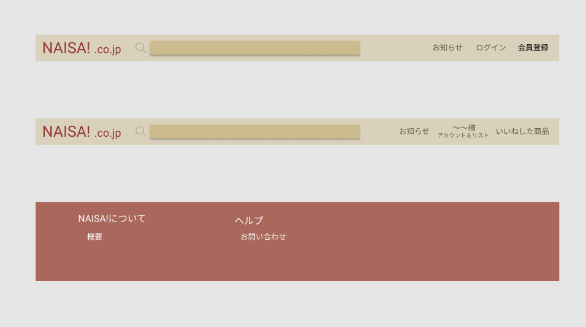

### ヘッダー(未ログイン時)

|ID|要素|内容|アクション|イベント|遷移先|
|:---|:---|:---|:---:|:---:|:---|
|1|バナー|サイト名表示|クリック|遷移|メインページ|
|2|虫眼鏡|アイコン表示|||||
|3|検索窓|テキストボックス|テキスト入力|遷移|商品一覧ページ|
|4|お知らせ|テキスト表示|クリック|遷移|お知らせページ|
|5|ログイン|テキスト表示|クリック|遷移|ログインページ|
|6|会員登録|テキスト表示|クリック|遷移|会員登録ページ|

### ヘッダー(ログイン時)

|ID|要素|内容|アクション|イベント|遷移先|
|:---|:---|:---|:---:|:---:|:---|
|1|バナー|サイト名表示|クリック|遷移|メインページ|
|2|虫眼鏡|アイコン表示||||
|3|検索窓|テキストボックス|テキスト入力|遷移|商品一覧ページ|
|4|お知らせ|テキスト表示|クリック|遷移|お知らせページ|
|5|アカウント&リスト|テキスト表示|クリック|遷移|アカウント情報ページ|
|6|会員登録|テキスト表示|クリック|遷移|会員登録ページ|

### フッター

|ID|要素|内容|アクション|イベント|遷移先|
|:---|:---|:---|:---:|:---:|:---|
|1|NAISA!について|テキスト表示||||
|2|ヘルプ|テキスト表示||||
|3|概要|テキスト表示|クリック|||
|4|お問い合わせ|テキスト表示|クリック|遷移|お問い合わせページ|

---

### メインページ
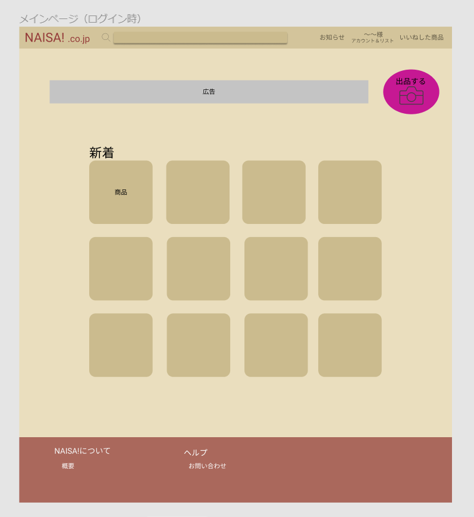

|ID|要素|内容|アクション|イベント|遷移先|
|:---|:---|:---|:---:|:---:|:---|
|1|広告|広告表示|クリック|遷移|広告のページ|
|2|新着|テキスト表示||||
|3|出品する|アイコン表示|クリック|遷移|出品情報入力ページ|
|4|商品画像|画像表示|クリック|遷移|商品詳細ページ|

### 商品一覧
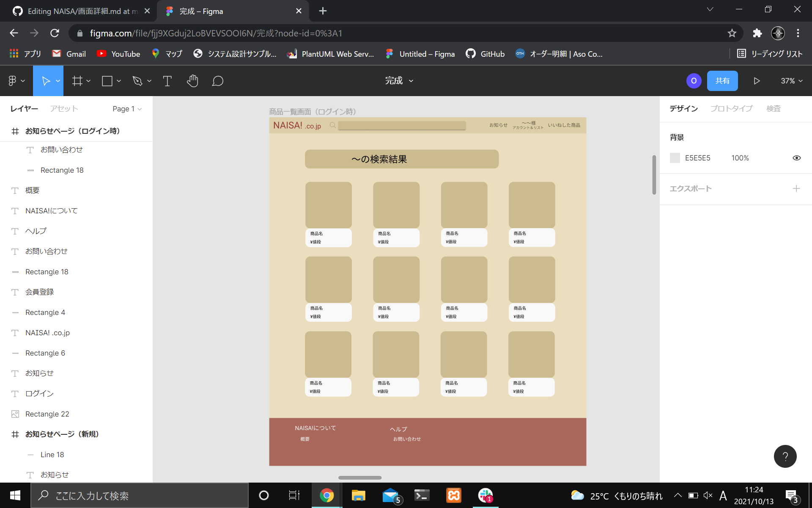
|ID|要素|内容|アクション|イベント|遷移先|
|:---|:---|:---|:---:|:---:|:---|
|1|(検索ワード)の検索結果|テキスト表示||||
|2|商品画像|画像表示|クリック|遷移|商品詳細ページ|
|3|商品名|一定文字数以上は「...」に|クリック|遷移|商品詳細ページ|
|4|￥値段|商品価格表示、3桁区切り||||

## 購入者サイド

### 商品詳細ページ
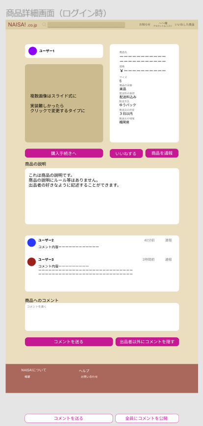

|ID|要素|内容|アクション|イベント|遷移先|
|:---|:---|:---|:---:|:---:|:---|
|1|ユーザー名|出品ユーザー名、アイコン表示||||
|2|商品画像|画像複数時スライド||||
|3|商品名|テキスト表示二行、30文字|||||
|4|商品価格|￥マーク横3桁区切り表示、上限10万||||
|5|その他商品情報|空の情報は表示しない||||
|6|購入手続きへ|ボタン表示|クリック|遷移|購入ページ|
|7|いいね|ボタン表示|クリック|いいね情報更新|
|8|商品を通報|ボタン表示|クリック|遷移|商品通報ページ|
|9|商品の説明|テキスト表示、10行程度||||
|10|コメントユーザー|ユーザー名、アイコン表示|||
|11|コメント時間|1時間未満で分数、1時間以上で時間表示 24時間以上で日数表示、いずれも経過時間||||
|12|通報|テキスト表示|クリック|遷移|コメント通報ページ|
|13|コメント内容|テキスト表示、行数等未定||||
|14|商品へのコメント|テキストエリア、行数等未定|テキスト入力|||
|15|コメントを送る|ボタン表示|クリック|コメント情報更新||

### 購入ページ

|ID|要素|内容|アクション|イベント|遷移先|
|:---|:---|:---|:---:|:---:|:---|
|1|ユーザー名|テキスト表示||||
|2|商品の画像|画像表示、複数枚時クリックで表示画像変更||||
|3|商品名|テキスト表示二行|||
|4|￥値段|￥マーク横3桁区切り表示、上限10万||||
|5|支払方法|テキスト表示||||
|6|配送先|テキスト表示||||
|7|商品の価格|テキスト表示||||
|8|支払い金額|テキスト表示||||
|9|支払い方法|テキスト表示||||
|10|購入する|ボタン表示|クリック|遷移|取引ページ|

### 取引ページ
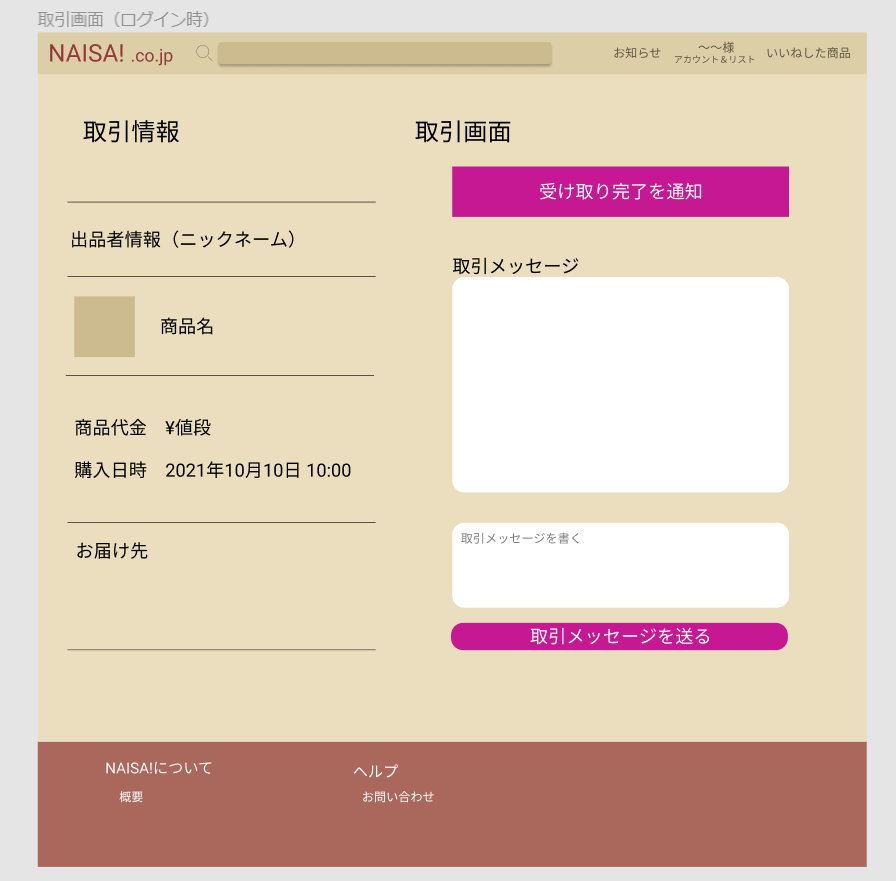

|ID|要素|内容|アクション|イベント|遷移先|
|:---|:---|:---|:---:|:---:|:---|:---|
|1|取引情報|テキスト表示|||||
|2|出品者情報|テキスト表示|||||
|3|商品画像|画像表示|||||
|4|商品名|テキスト表示|||||
|5|商品代金|テキスト表示|||||
|6|購入日時|テキスト表示|||||
|7|お届け先|テキスト表示|||||
|8|住所表示エリア|テキスト表示|||||
|9|取引画面|テキスト表示|||||
|10|受け取り完了を通知|ボタン表示|クリック|遷移||取引完了ページ|
|11|取引メッセージ|テキスト表示|||||
|12|メッセージ表示エリア|テキスト表示||||order_comment|
|13|メッセージ入力エリア|テキストボックス|入力|||order_comment|
|14|取引メッセージを送る|ボタン表示|クリック|メッセージ送信|||
||||||||

### 取引完了ページ
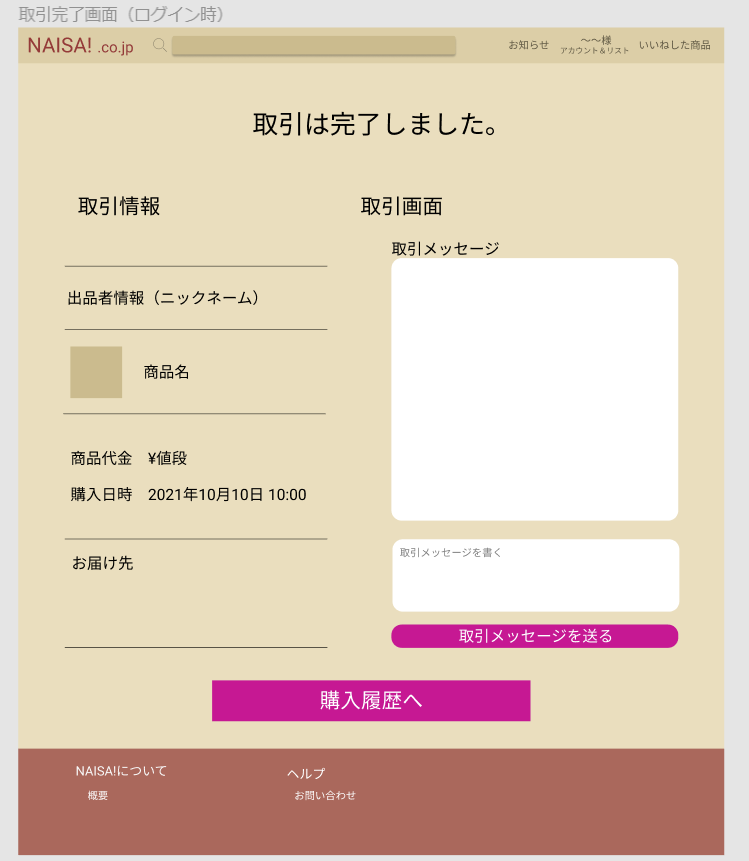

|ID|要素|内容|アクション|イベント|遷移先|
|:---|:---|:---|:---:|:---:|:---|
|1|取引は完了しました|テキスト表示||||
|2|取引情報|テキスト表示||||
|3|出品者情報|テキスト表示||||
|4|商品画像|画像表示||||
|5|商品名|テキスト表示||||
|6|商品代金|テキスト表示||||
|7|購入日時|テキスト表示||||
|8|お届け先|テキスト表示||||
|9|住所表示エリア|テキスト表示||||
|10|取引画面|テキスト表示||||
|11|取引完了する|ボタン表示|クリック|遷移||
|12|取引メッセージ|テキスト表示||||
|13|メッセージ表示エリア|テキスト表示||||
|14|メッセージ入力エリア|テキストボックス|入力|||
|15|取引メッセージを送る|ボタン表示|クリック|メッセージ送信||

### 商品ページ

|ID|要素|内容|アクション|イベント|遷移先|
|:---|:---|:---|:---:|:---:|:---|
|1|ユーザー名|出品ユーザー名、アイコン表示||||
|2|商品画像|画像複数時スライド||||
|3|商品名|テキスト表示二行、30文字|||||
|4|商品価格|￥マーク横3桁区切り表示、上限10万||||
|5|その他商品情報|空の情報は表示しない||||
|6|購入手続きへ|ボタン表示|クリック|遷移|購入ページ|
|7|いいね|ボタン表示|クリック|いいね情報更新|
|8|商品を通報|ボタン表示|クリック|遷移|商品通報ページ|
|9|商品の説明|テキスト表示、10行程度||||
|10|通報理由を選択|||||
|||||||

---

## 販売者サイド

### 出品情報入力ページ
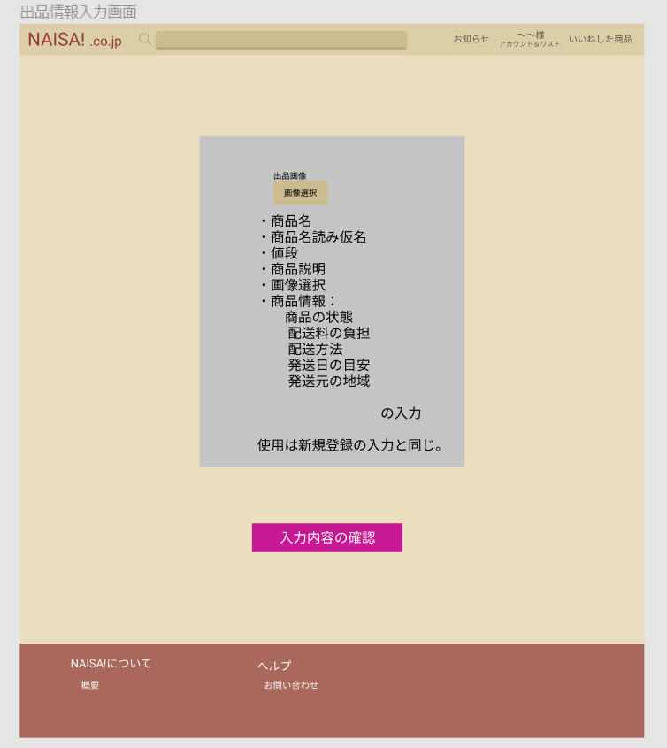

|ID|要素|内容|アクション|イベント|遷移先|
|:---|:---|:---|:---:|:---:|:---|
|1|商品画像|テキスト表示||||
|2|画像アップロード|ファイル|ファイル選択|||
|3|商品名|テキスト表示||||
|4|商品名|テキストボックス|入力|||
|5|値段|テキスト表示||||
|6|値段|テキストボックス|入力|||
|7|商品説明|テキスト表示||||
|8|商品説明|テキストエリア|入力|||
|9|商品情報|テキスト表示||||
|10|商品情報|テキストボックス|入力|||
|11|配送料の負担|テキスト表示||||
|12|配送料の負担|テキストボックス|入力|||
|13|配送方法|テキスト表示||||
|14|配送方法|テキストボックス||||
|15|発送日の目安|テキスト表示||||
|16|発送日の目安|テキストボックス|入力|||
|17|発送元の地域|テキスト表示||||
|18|発送元の地域||入力|||
|19|入力内容の確認|ボタン表示|クリック|遷移|出品情報確認ページ|

### 出品情報確認ページ
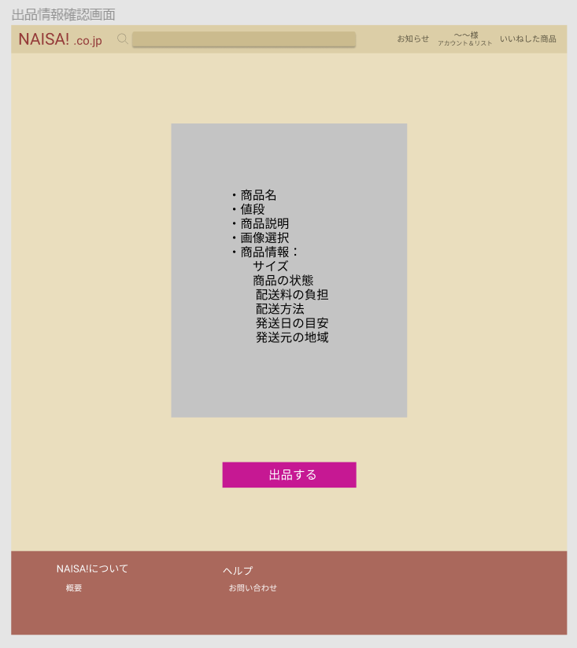

|ID|要素|内容|アクション|イベント|遷移先|
|:---|:---|:---|:---:|:---:|:---|
|1|商品画像|テキスト表示||||
|2|画像表示|画像表示||||
|3|商品名|テキスト表示||||
|4|商品名表示|テキスト表示||||
|5|値段|テキスト表示||||
|6|値段表示|テキスト表示||||
|7|商品説明|テキスト表示||||
|8|商品説明表示|テキストエリア||||
|9|商品情報|テキスト表示||||
|10|商品情報表示|テキスト表示||||
|11|配送料の負担|テキスト表示||||
|12|配送料の負表示担|テキスト表示||||
|13|配送方法|テキスト表示||||
|14|配送方法表示|テキスト表示||||
|15|発送日の目安|テキスト表示||||
|16|発送日の目安表示|テキスト表示||||
|17|発送元の地域|テキスト表示||||
|18|発送元の地域表示|テキスト表示||||
|19|出品する|ボタン表示|クリック|遷移|出品完了ページ|

### 出品完了ページ
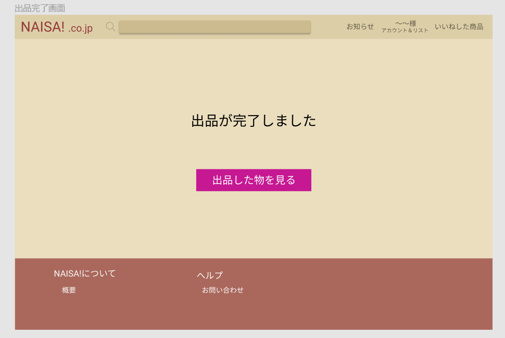
|ID|要素|内容|アクション|イベント|遷移先|
|:---|:---|:---|:---:|:---:|:---|
|1|出品が完了しました|テキスト表示||||
|2|出品した物を見る|ボタン表示|クリック|遷移|出品詳細ページ|

### 出品詳細ページ
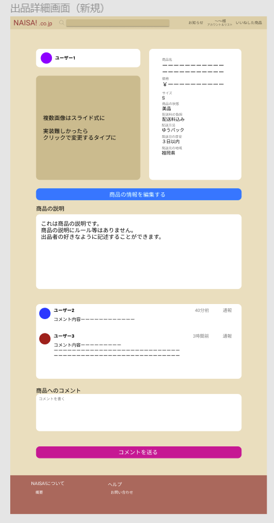

|ID|要素|内容|アクション|イベント|遷移先|
|:---|:---|:---|:---:|:---:|:---|
|1|商品画像|画像表示|スライド|画像切替||
|2|コメント|テキスト表示||||
|3|コメント表示|テキスト表示||||
|4|商品へのコメント|テキスト表示||||
|5|コメント入力|テキストボックス|入力|||
|6|コメントを送る|ボタン表示|クリック|コメント送信||
|7|商品名|テキスト表示||||
|8|値段|テキスト表示||||
|9|いいね|アイコン表示|クリック|いいね|
|10|ｺﾒﾝﾄﾏｰｸ|アイコン表示|クリック|コメント入力||
|11|商品説明|テキスト表示||||
|12|商品の編集|ボタン表示|クリック|遷移|購入ページ|
|13|商品情報|テキスト表示||||

### 出品編集ページ
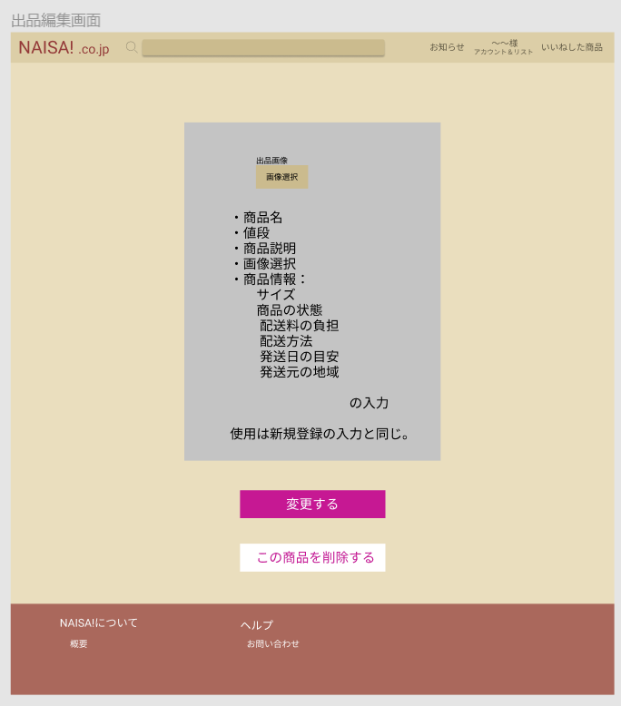

|ID|要素|内容|アクション|イベント|遷移先|
|:---|:---|:---|:---:|:---:|:---|
|1|商品画像|テキスト表示||||
|2|画像アップロード|ファイル|ファイル選択|||
|3|商品名|テキスト表示||||
|4|商品名|テキストボックス|入力|||
|5|値段|テキスト表示||||
|6|値段|テキストボックス|入力|||
|7|商品説明|テキスト表示||||
|8|商品説明|テキストエリア|入力|||
|9|商品情報|テキスト表示||||
|10|商品情報|テキストボックス|入力|||
|11|配送料の負担|テキスト表示||||
|12|配送料の負担|テキストボックス|入力|||
|13|配送方法|テキスト表示||||
|14|配送方法|テキストボックス||||
|15|発送日の目安|テキスト表示||||
|16|発送日の目安|テキストボックス|入力|||
|17|発送元の地域|テキスト表示||||
|18|発送元の地域||入力|||
|19|変更する|ボタン表示|クリック|遷移|出品情報確認ページ|
|20|この商品を削除する|ボタン表示|クリック|ポップアップ||

---

## アカウント系統

### 新規登録ページ
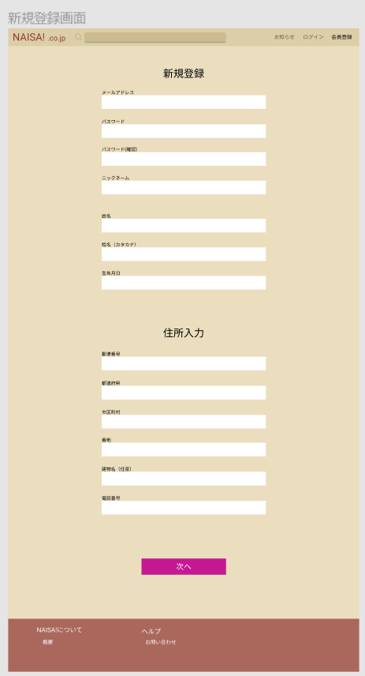

|ID|要素|内容|アクション|イベント|遷移先|
|:---|:---|:---|:---:|:---:|:---|:---|
|1|メールアドレス|テキスト表示|||||
|2|メールアドレス|テキストボックス|入力||||
|3|パスワード|テキスト表示|||||
|4|パスワード|テキストボックス|入力||||
|5|パスワード再入力|テキスト表示|||||
|6|パスワード再入力|テキストボックス|入力||||
|7|ニックネーム|テキスト表示|||||
|8|ニックネーム|テキストボックス|入力||||
|9|姓名|テキスト表示|||||
|10|姓名|テキストボックス|入力||||
|11|姓名(カタカナ)|テキスト表示|||||
|12|姓名(カタカナ)|テキストボックス|入力||||
|13|生年月日|テキスト表示|||||
|14|生年月日|テキストボックス|入力||||
|15|登録する|ボタン表示|クリック|遷移|クレジットカード登録ページ||

### クレジットカード新規登録ページ
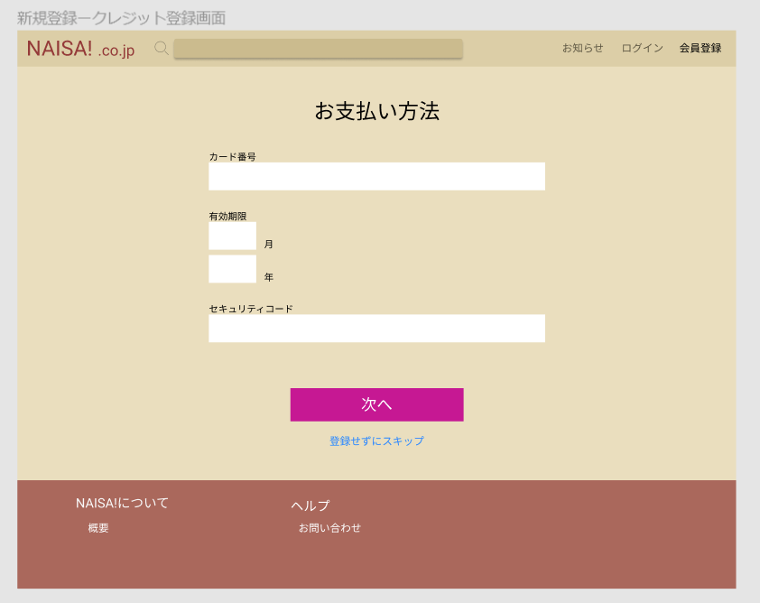

|ID|要素|内容|アクション|イベント|遷移先|
|:---|:---|:---|:---:|:---:|:---|:---|
|1|お支払い方法|テキスト表示|||||
|2|カード番号|テキスト表示|||||
|3|カード番号|テキストボックス|入力||||
|4|有効期限|テキスト表示|||||
|5|月|テキストボックス|入力||||
|6|月|テキスト表示|||||
|7|年|テキストボックス|入力||||
|8|年|テキスト表示|||||
|9|セキュリティコード|テキスト表示|||||
|10|セキュリティコード|テキストボックス|入力||||
|11|登録する|ボタン表示|クリック|遷移|登録内容確認ページ||

### 登録内容確認ページ
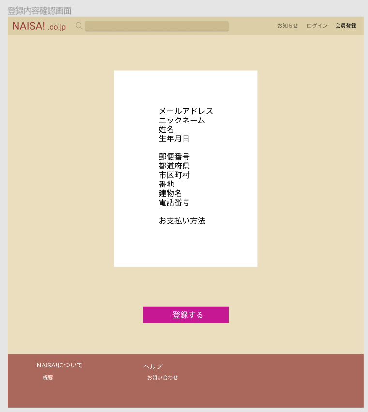

|ID|要素|内容|アクション|イベント|遷移先|
|:---|:---|:---|:---:|:---:|:---|:---|
|1|メールアドレス|テキスト表示||||user|
|2|ニックネーム|テキスト表示|||user|
|3|姓名|テキスト表示||||user|
|4|生年月日|テキスト表示||||user|
|5|郵便番号|テキスト表示||||user|
|6|都道府県|テキスト表示||||user|
|7|市区町村|テキスト表示||||user|
|8|番地|テキスト表示||||user|
|9|建物名|テキスト表示||||user|
|10|電話番号|テキスト表示||||user|
|11|お支払い方法|テキスト表示||||card|
|12|登録する|ボタン表示|クリック|遷移|認証完了ページ||

### 認証完了ページ
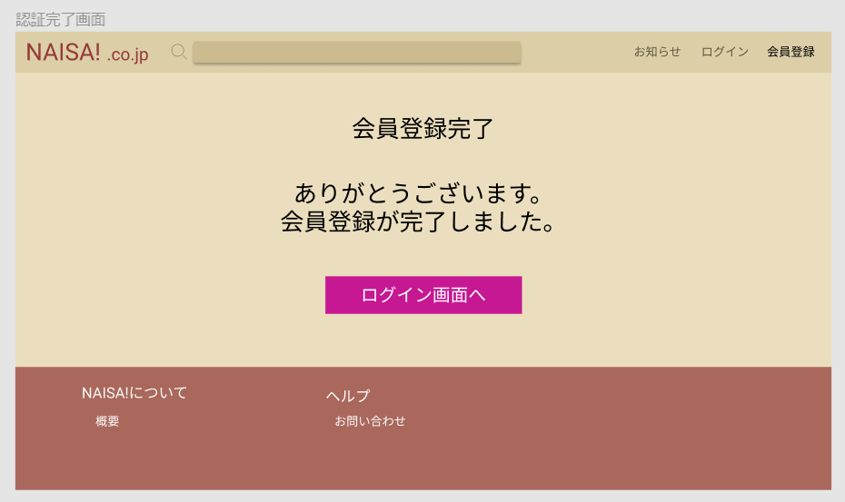

|ID|要素|内容|アクション|イベント|遷移先|
|:---|:---|:---|:---:|:---:|:---|:---|
|1|会員登録完了|テキスト表示||||
|2|完了を示す文 ^1|テキスト表示|||||
|3|ログイン画面へ|ボタン表示|クリック|遷移|ログインページ||

### ログインページ

|ID|要素|内容|アクション|イベント|遷移先|
|:---|:---|:---|:---:|:---:|:---|:---|
|1|ログイン|テキスト表示|||||
|1|メールアドレス|テキスト表示|||||
|2|メールアドレス|テキストボックス|入力|||user|
|3|パスワード|テキスト表示|||||
|4|パスワード|テキストボックス|入力|||user|
|5|ログイン|ボタン表示|クリック|遷移|メインページ||

### ログイン失敗ページ
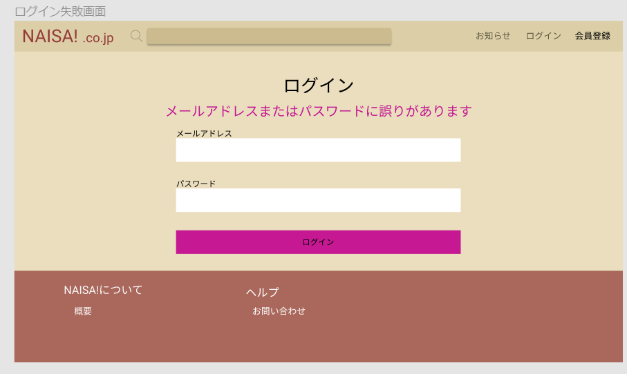

|ID|要素|内容|アクション|イベント|遷移先|
|:---|:---|:---|:---:|:---:|:---|:---|
|1|ログイン|テキスト表示|||||
|2|失敗理由を示す文 ^2|テキスト表示|||||
|3|メールアドレス|テキスト表示|||||
|4|メールアドレス|テキストボックス|入力|||user|
|5|パスワード|テキスト表示|||||
|6|パスワード|テキストボックス|入力|||user|
|7|ログイン|ボタン表示|クリック|遷移|メインページ||

### アカウント情報ページ
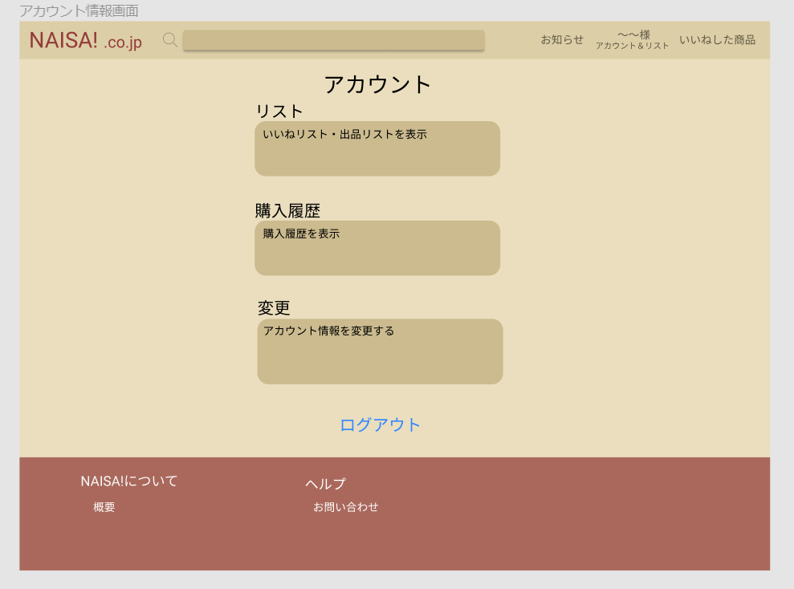

|ID|要素|内容|アクション|イベント|遷移先|
|:---|:---|:---|:---:|:---:|:---|:---|
|1|アカウント|テキスト表示|||||
|2|リスト|テキスト表示|||||
|3|いいねリストを表示|テキスト表示|クリック|遷移|いいねリストページ||
|4|購入履歴|テキスト表示|||||
|5|購入履歴を表示|テキスト表示|クリック|遷移|購入履歴ページ||
|6|変更|テキスト表示|||||
|7|アカウント情報を変更する|テキスト表示|クリック|遷移|アカウント情報編集ページ||

### いいねリストページ
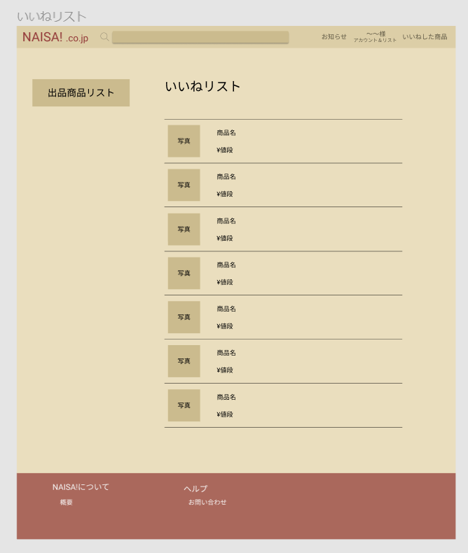

|ID|要素|内容|アクション|イベント|遷移先|
|:---|:---|:---|:---:|:---:|:---|:---|
|1|いいねリスト|テキスト表示|||||
|2|商品画像|画像表示|||||
|3|商品名|テキスト表示|||||
|4|値段|テキスト表示|||||

### 購入履歴ページ
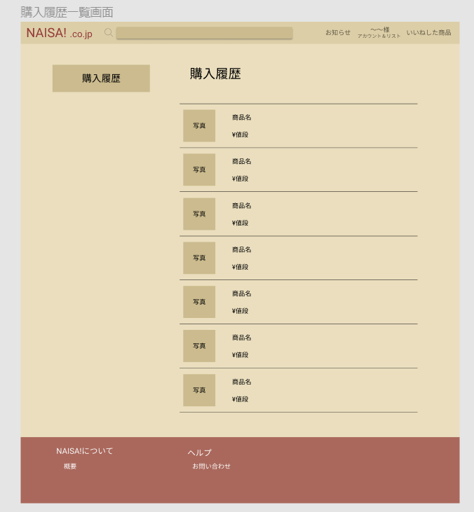

|ID|要素|内容|アクション|イベント|遷移先|
|:---|:---|:---|:---:|:---:|:---|:---|
|1|購入履歴|テキスト表示|||||
|2|写真|画像表示|||||
|3|商品名|テキスト表示|||||
|4|値段|テキスト表示|||||

### アカウント情報変更ページ
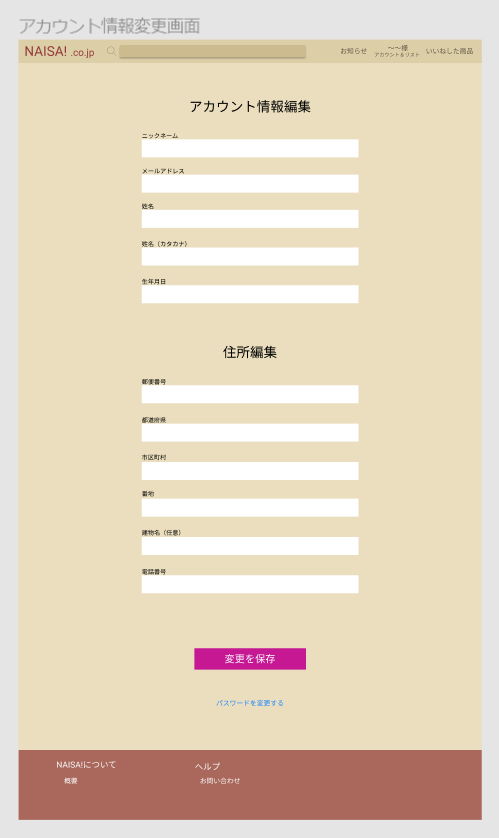

|ID|要素|内容|アクション|イベント|遷移先|
|:---|:---|:---|:---:|:---:|:---|:---|
|1|アカウント情報編集|テキスト表示|||||
|2|ニックネーム|テキスト表示|||||
|3|ニックネーム|テキストボックス|入力||||
|4|メールアドレス|テキスト表示|||||
|5|メールアドレス|テキストボックス|入力||||
|6|姓名|テキスト表示|||||
|7|姓名|テキストボックス|入力||||
|8|姓名(カタカナ)|テキスト表示|||||
|9|姓名(カタカナ)|テキストボックス|入力||||
|10|生年月日|テキスト表示|||||
|11|生年月日|テキストボックス|入力||||
|12|住所編集|テキスト表示|||||
|13|郵便番号|テキスト表示|||||
|14|郵便番号|テキストボックス|入力||||
|15|都道府県|テキスト表示|||||
|16|都道府県|テキストボックス|入力||||
|17|市区町村|テキスト表示|||||
|18|市区町村|テキストボックス|入力||||
|19|番地|テキスト表示|||||
|20|番地|テキストボックス|入力||||
|21|建物名|テキスト表示|||||
|22|建物名|テキストボックス|入力||||
|23|電話番号|テキスト表示|||||
|24|電話番号|テキストボックス|入力||||
|25|変更を保存|ボタン表示|クリック|遷移|ログインページ||
|26|パスワードを変更する|テキスト表示|クリック|遷移|パスワード変更ページ||

### パスワード変更ページ
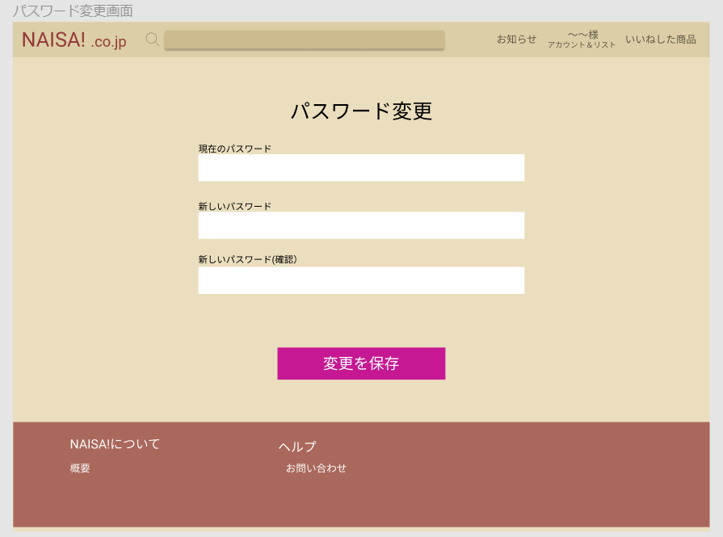

|ID|要素|内容|アクション|イベント|遷移先|
|:---|:---|:---|:---:|:---:|:---|:---|
|1|パスワード変更|テキスト表示|||||
|2|現在のパスワード|テキスト表示|||||
|3|現在のパスワード|テキストボックス|入力||||
|4|新しいパスワード|テキスト表示|||||
|5|新しいパスワード|テキストボックス|入力||||
|6|新しいパスワード再入力|テキスト表示|||||
|7|新しいパスワード再入力|テキストボックス|入力||||
|8|変更を保存|ボタン表示|クリック|遷移|ログインページ||

---

## 運営からの情報系統

### お知らせページ

|ID|要素|内容|アクション|イベント|遷移先|
|:---|:---|:---|:---:|:---:|:---|:---|
|1|お知らせ|テキスト表示|||||
|2|現在お知らせはありません|テキスト表示|||||

### 概要ページ

|ID|要素|内容|アクション|イベント|遷移先|
|:---|:---|:---|:---:|:---:|:---|:---|
|1|NAISA!とは|テキスト表示|||||
|2|NAISA!について^3|テキスト表示|||||

### お問い合わせページ/未ログイン時

|ID|要素|内容|アクション|イベント|遷移先|
|:---|:---|:---|:---:|:---:|:---|:---|
|1|お問い合わせ|テキスト表示|||||
|2|お名前|テキスト表示|||||
|3|お名前|テキストボックス|入力||||
|4|メールアドレス|テキスト表示|||||
|5|メールアドレス|テキストボックス|入力||||
|6|メールアドレス|テキスト表示|||||
|7|メールアドレス|テキストボックス|入力||||
|8|お問い合わせ内容|テキスト表示|||||
|9|お問い合わせ内容|テキストボックス|入力||||
|10|画像添付|テキスト表示|||||
|11|画像選択|ファイル|ファイル選択||||
|12|送信する|ボタン表示|クリック|遷移|お問い合わせ完了ページ||

### お問い合わせページ/ログイン時

|ID|要素|内容|アクション|イベント|遷移先|
|:---|:---|:---|:---:|:---:|:---|:---|
|1|お問い合わせ|テキスト表示|||||
|2|お問い合わせ内容|テキスト表示|||||
|3|メールアドレス|テキストボックス|入力||||
|4|画像添付|テキスト表示|||||
|5|画像選択|ファイル|ファイル選択||||
|6|送信する|ボタン表示|クリック|遷移|お問い合わせ完了ページ||

### お問い合わせページ/ログイン時

|ID|要素|内容|アクション|イベント|遷移先|
|:---|:---|:---|:---:|:---:|:---|:---|
|1|お問い合わせが完了しました|テキスト表示|||||
|2|トップ|ボタン表示|クリック|遷移|トップページ||
